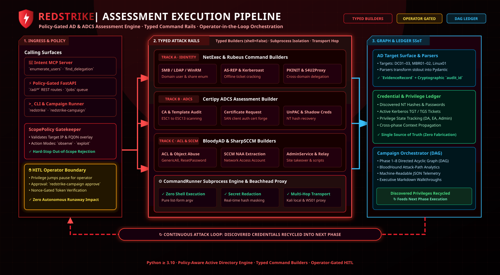

# RedStrike

<p align="center">
  
</p>

<p align="center">
  <a href="https://github.com/Ganron007/RedStrike/actions/workflows/ci.yml"></a>
  <a href="LICENSE"></a>
  =3.10">
  
</p>

> [!IMPORTANT]
> **Authorized use only.** RedStrike is an offensive security tool. Use it **only** for
> authorized security assessments against systems and accounts you are explicitly permitted
> to test. Unauthorized scanning, enumeration, or access attempts are illegal. The authors
> and contributors accept no liability for any misuse or damage.

RedStrike is an agentic Active Directory and ADCS assessment toolkit: intent-level
HTTP and MCP APIs, typed command builders (`shell=False`), scope policy, a credential
ledger, human-in-the-loop gates, and a campaign-graph orchestrator.

Lab graphs, seeds, and attack scripts are **not** shipped here. Use the bundled
`examples/` demo, or pass your own `--graph` / `--seed`.

| | |
|---|---|
| Package | `redstrike` |
| Commands | `redstrike` · `redstrike-api` · `redstrike-mcp` · `redstrike-campaign` |
| Setup | [`docs/SETUP.md`](docs/SETUP.md) |
| Secrets | [`docs/SECURITY.md`](docs/SECURITY.md) |
| Contributing | [`CONTRIBUTING.md`](CONTRIBUTING.md) |

## Capabilities

- AD-native operations instead of a generic “run this shell string” endpoint.
- Typed builders with `shell=False` (NetExec, Certipy, Rubeus, bloodyAD, and others).
- Scope policy before execution (`scope.yaml` overlays a built-in profile).
- Evidence records for every observation; JSON and Markdown reports.
- Default **API** profile is read-only (`observe` / `assess`).
- Campaign `--execute` is operator-gated (HITL). Privilege jumps wait for `redstrike-campaign approve`.
- MCP and HTTP expose intent-level tools such as `enumerate_domain_users` and
  `find_delegation`, not arbitrary command strings.

## Quick start

Full walkthrough (Windows included): [`docs/SETUP.md`](docs/SETUP.md).

```bash
python -m venv .venv
source .venv/bin/activate   # Windows: .venv\Scripts\Activate.ps1
pip install -e ".[dev,mcp]"
cp examples/scope.example.yaml scope.yaml   # edit; never commit
redstrike check
redstrike-campaign run --phase 1-3 --beachhead windows --operator provisioning --engage demo \
  --graph examples/campaign-graph.m1.yaml \
  --seed examples/seed.example.json \
  --automation-root examples/automation
```

Start the API with a **local** key (do not commit it):

```bash
export REDSTRIKE_API_KEY="$(python -c 'import secrets; print(secrets.token_urlsafe(32))')"
redstrike-api --scope scope.yaml --profile standalone --api-key "$REDSTRIKE_API_KEY" --host 127.0.0.1 --port 8890
curl http://127.0.0.1:8890/health
```

## Architecture

RedStrike runs as a single FastAPI process. HTTP clients and the MCP proxy share the
same policy-gated pipeline before a typed command is executed.

<p align="center">
  
</p>

1. **Ingress** — HTTP `/ad/*`, or MCP tools that `POST` to the same routes.
2. **Auth** — non-loopback callers must send `X-API-Key` when `--api-key` is set.
3. **Policy** — `ScopePolicy.assert_allowed` rejects out-of-scope targets, domains, modes, or actions.
4. **Guardrails** — per-target / per-domain concurrency and cooldown, released in `finally`.
5. **Execute** — typed `argv`, `subprocess` with secret redaction and a timeout.
6. **Normalize** — parsers produce entities, evidence, and optional findings.
7. **Report** — `render_json_report` / Markdown.

The HTTP API and the in-memory job worker share one process. Do not load-balance
multiple API replicas unless you add an external job store.

## HTTP API

Replace `dc.example.lab` with a host already listed in **your** `scope.yaml`.
`$REDSTRIKE_API_KEY` is an environment variable, not a committed secret.

```bash
curl -X POST http://127.0.0.1:8890/ad/users \
  -H "Content-Type: application/json" \
  -H "X-API-Key: $REDSTRIKE_API_KEY" \
  -d '{
    "target": "dc.example.lab",
    "domain": "example.lab",
    "username": "operator_user",
    "password": "<REDACTED>"
  }'
```

Long-running work can be submitted as jobs (`PENDING → RUNNING → COMPLETED` or `FAILED`).
Duplicate in-flight work is deduplicated by action / target / domain / mode.

```bash
curl -X POST http://127.0.0.1:8890/jobs \
  -H "Content-Type: application/json" \
  -H "X-API-Key: $REDSTRIKE_API_KEY" \
  -d '{"action": "domain_users", "target": "dc.example.lab", "domain": "example.lab"}'

curl http://127.0.0.1:8890/jobs/{job_id} -H "X-API-Key: $REDSTRIKE_API_KEY"
```

MCP (optional), with the API already on loopback:

```bash
redstrike-mcp --api http://127.0.0.1:8890
```

A sample client snippet is in `redstrike/api/redstrike-mcp.json`.

## Campaign orchestrator

This repository ships a **demo graph** only. Point the CLI at your engagement files,
or use `examples/`:

```bash
redstrike-campaign run --phase 1-3 --beachhead windows --operator provisioning --engage demo \
  --graph examples/campaign-graph.m1.yaml \
  --seed examples/seed.example.json \
  --automation-root examples/automation
```

- Branches: `--branch A|B|C|…` · streams: `redstrike-campaign stream E|F`
- Privilege jumps pause until `redstrike-campaign approve --gate <name> --engage <id>`
- Live `--execute` needs operator tools on PATH (`redstrike check --execute-ready`)
- Optional SSH to a Windows beachhead via `REDSTRIKE_WS01_HOST`, `REDSTRIKE_WS01_USER`,
  `REDSTRIKE_WS01_SSH_KEY` (no lab defaults in this repo)

## Reporting

```python
from redstrike.reporting.json_report import render_json_report

report = render_json_report(findings, evidence)
```

The result is a dict with `tool`, `generated_at`, `summary`, `findings`, and `evidence`.

## Safety model

Default API profile (`standalone`) allows read-only AD assessment:

- Domain users, groups, and computers
- Password policy
- SMB shares
- AS-REP roastability and Kerberoastability collection
- Delegation and AdminCount discovery
- ADCS enumeration

High-risk campaign actions (DCSync, ticket forgery, ACL writes, and similar) run only
through the orchestrator with HITL approval. Do not bypass those gates.

Operational defaults:

- Bind the API to `127.0.0.1` unless you have a deliberate exposure plan.
- Non-loopback callers must send `X-API-Key` when `--api-key` is set.
- MCP rejects non-local plain HTTP API URLs; use HTTPS off-box.
- Command runners redact password and hash flags in logs and evidence argv.
- Never commit `scope.yaml`, `.env`, API keys, SSH private keys, or engagement passwords.

## License

RedStrike is released under the [MIT License](LICENSE).

Copyright (c) 2026 RedStrike
