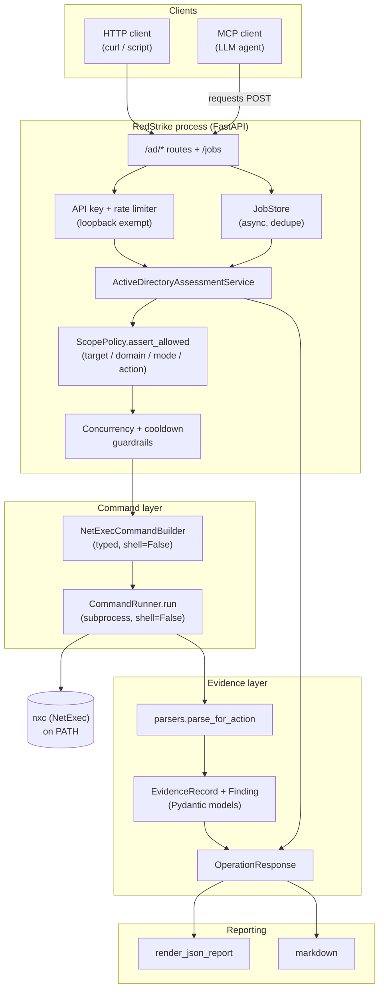

# RedStrike

<p align="center">
  
</p>

<p align="center">
  <a href="https://github.com/CADRE-Platform/RedStrike/actions/workflows/ci.yml"></a>
  <a href="LICENSE"></a>
  =3.10">
  
  
</p>

> [!IMPORTANT]
> **Authorized use only.** RedStrike is an offensive security tool. Use it **only** for
> authorized security assessments against systems and accounts you are explicitly permitted
> to test. Unauthorized scanning, enumeration, or access attempts are illegal. The authors
> and contributors accept no liability for any misuse or damage.

RedStrike is an advanced **agentic AD / ADCS pentesting and red-teaming toolset**:
intent-level ops, typed builders (`shell=False`), scope policy, credential ledger,
HITL gates, and a campaign-graph engine — built to beat free-form LLM shell wrappers
on fidelity and safety. It keeps improving as a standalone product.

It is also the orchestrator for the CADRE lab campaign (CADRE supplies graph, lab
seeds, and profiles as **integration glue** — not hardcoded product identity).
CADRE => **CLOUD | AGENTIC | DFIR | REDTEAM | ENVIRONMENT**.

## What is different

- AD-native workflows instead of one generic command execution endpoint.
- Typed command builders with `shell=False`.
- Scope policy before execution.
- Evidence records for every observation.
- Read-only first: no password spraying, dumping, persistence, or account changes in
  the default MVP.
- MCP and HTTP APIs expose intent-level operations such as `enumerate_domain_users`
  and `find_delegation`, not arbitrary command strings.

## Tool Flow

RedStrike runs as a single FastAPI process. Every request — whether it arrives over
HTTP or is proxied through the MCP server — flows through the same policy-gated
pipeline before a typed NetExec command is executed.



**Request lifecycle:**

1. **Ingress** — HTTP clients hit `/ad/*` directly; MCP clients call intent-level
   tools (`enumerate_domain_users`, `find_delegation`, …) that `POST` to the same
   HTTP routes via `requests`.
2. **Auth & throttle** — non-loopback callers must present a valid `X-API-Key` and
   pass the in-memory sliding-window `RateLimiter`.
3. **Policy gate** — `ScopePolicy.assert_allowed` rejects out-of-scope targets,
   domains, modes, or non-read-only actions before anything runs.
4. **Guardrails** — per-target/per-domain concurrency caps and cooldown windows are
   acquired, then released in a `finally` block.
5. **Build & execute** — `NetExecCommandBuilder` produces a typed `argv` (no shell),
   `CommandRunner` runs it as a `subprocess` with secret redaction and a timeout.
6. **Normalize** — `parsers.parse_for_action` turns raw output into entities; an
   `EvidenceRecord` (and any derived `Finding`) is attached to the
   `OperationResponse`.
7. **Report** — responses serialize through `render_json_report` / `markdown` for
   downstream consumption.

Long-running work can instead be submitted to `/jobs`; `JobStore` dedupes by
action/target/domain/mode and runs the same service method on a worker thread
(`PENDING → RUNNING → COMPLETED`).

## Quick Start

```bash
python -m venv .venv
source .venv/bin/activate
pip install -e ".[dev,mcp]"
cp examples/scope.example.yaml scope.yaml
redstrike-api --scope scope.yaml --profile lab-readonly --api-key "change-me" --host 127.0.0.1 --port 8890
```

Health check:

```bash
curl http://127.0.0.1:8890/health
```

## Example API Call

```bash
curl -X POST http://127.0.0.1:8890/ad/users \
  -H "Content-Type: application/json" \
  -H "X-API-Key: change-me" \
  -d '{
    "target": "192.168.1.7",
    "domain": "ignite.local",
    "username": "raaz",
    "password": "<REDACTED_PASSWORD>"
  }'
```

## Security Defaults

- Keep the API bound to `127.0.0.1` unless you have a deliberate network exposure plan.
- When `--api-key` is configured, non-loopback callers must provide `X-API-Key`.
- MCP rejects non-local plain HTTP API URLs; use HTTPS for remote API endpoints.
- Execution guardrails apply by policy profile (per-target/domain concurrency and cooldown windows).

## Deployment

RedStrike runs as a **single process**. The HTTP API and the job worker share the same
process and in-memory job store, so do not run multiple API replicas behind a load
balancer unless you have an external shared store — jobs created on one replica are not
visible to another.

```bash
redstrike-api --scope scope.yaml --profile lab-readonly --api-key "change-me" --host 127.0.0.1 --port 8890
```

## Async Jobs API

Long-running assessments can be submitted as jobs and polled for status:

```bash
# Submit a job
curl -X POST http://127.0.0.1:8890/jobs \
  -H "Content-Type: application/json" \
  -H "X-API-Key: change-me" \
  -d '{"action": "domain_users", "target": "192.168.1.7", "domain": "ignite.local"}'

# Poll for the result
curl http://127.0.0.1:8890/jobs/{job_id} -H "X-API-Key: change-me"
```

A job transitions `PENDING → RUNNING → COMPLETED` (or `FAILED`). Submitting the same
`action`/`target`/`domain`/`mode` again returns the existing in-flight or completed job
instead of starting a duplicate; a `FAILED` job can be retried.

## Campaign graph engine (optional CADRE consumer)

```bash
pip install -e .
export CADRE_ROOT=/path/to/CADRE   # graph + seeds + automation scripts
# Hybrid (orchestrator on Kali/.60 → SSH into ws01):
redstrike-campaign start --beachhead windows --operator provisioning --engage lab1
redstrike-campaign run --phase 0.5-8 --beachhead windows --operator provisioning --engage lab1
# Native (orchestrator on domain-joined ws01 — no SSH wrap; default on win32):
redstrike-campaign start --beachhead windows --operator ws01 --engage lab-native
redstrike-campaign run --phase 1-3 --beachhead windows --operator ws01 --engage lab-native
redstrike-campaign run --phase 8 --beachhead windows --engage lab1 --branch C
redstrike-campaign stream E --engage lab1          # network-defense exercises (phase 9)
redstrike-campaign stream F --engage lab1          # supply-chain exercises (phase 10)
redstrike-campaign approve --gate dcsync --engage lab1
```

- Lab **graph / seeds / profiles** live in CADRE `Campaign/automation/` when present
- **Dual operators:** `provisioning` (hybrid) · `ws01` (native) — see CADRE `Red-Strike-workflow.md`
- Typed **intents** (Certipy/Rubeus/bloodyAD/SQL/SharpSCCM/mimikatz) — MCP `build_intent`
- `--branch …` · HITL · `--prefer-script` · `stream E|F` (no ws01 routing)
- Plan 1.1 **complete**; engine **0.5.2**; live `--execute` is HITL-gated

See [`ROADMAP.md`](ROADMAP.md) · [`CHANGELOG.md`](CHANGELOG.md).

## Reporting

Findings and evidence can be exported as a structured report:

```python
from cadre_strike.reporting.json_report import render_json_report

report = render_json_report(findings, evidence)
```

`render_json_report` returns a dict with `tool`, `generated_at`, `summary`, `findings`,
and `evidence`, ready to serialize to JSON for downstream consumption.

## License

RedStrike is released under the [MIT License](LICENSE). See the [LICENSE](LICENSE)
file for the full text.

> Copyright (c) 2026 RedStrike

## Safety Model

RedStrike currently allows only read-only AD assessment actions:

- Domain user enumeration
- Domain group enumeration
- Computer enumeration
- Password policy enumeration
- SMB share enumeration
- AS-REP roastability collection
- Kerberoastability collection
- Delegation discovery
- AdminCount discovery
- ADCS enumeration

Destructive or high-risk actions belong behind explicit approval gates in a later
`validate` mode.
