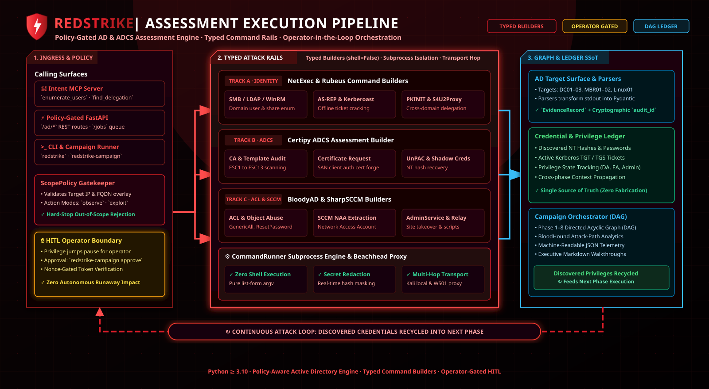

# RedStrike Architecture

RedStrike is a modular, policy-gated Active Directory, ADCS, and Hybrid Identity assessment framework. It provides two complementary execution models with native **[C2Stack](https://github.com/Ganron007/C2Stack)** in-memory post-exploitation support:

1. **Deterministic DAG Graph Engine** — Executes structured, repeatable YAML attack graphs with `depends_on` dependency gates (topological ordering, cycle validation), `when` conditions (`verified`/`unverified`/`cred`), fail-closed verification, and dual-mode dispatch (Direct vs C2-Enabled).
2. **Autonomous LLM Agent Interface (FastMCP / REST API)** — Connects AI models (Claude, GPT-4o, Cursor, Cline) to explore and chain Active Directory attack paths dynamically via typed tool intents, BloodHound graph queries, and live C2 session orchestration (`c2_execute_assembly`, `c2_shell`, `c2_psexec`).

---

## High-Level Architecture Diagram

  

---

## 1. Dual Execution Interface

### 1A. Deterministic DAG Graph Engine
- **CLI Commands:** `redstrike graph run` / `redstrike campaign run`
- **Execution Mechanism:** Reads declarative YAML graphs defining attack nodes, required credentials, execution beachheads, and success markers.
- **Use Cases:**
  - Automated Breach and Attack Simulation (BAS).
  - Continuous compliance validation and Active Directory hardening audits.
  - Repeatable, scripted red team scenarios.
- **Starter Templates (`examples/`):**
  - `generic-ad-recon.yaml`: LDAP user/group enumeration, AS-REP roasting, Kerberoasting, and ADCS discovery.
  - `generic-adcs-audit.yaml`: ESC1–ESC15 template auditing, vulnerable certificate request, and PKINIT NT hash recovery.
  - `generic-privilege-escalation.yaml`: Multi-hop attack chain from initial discovery to Shadow Credentials, ESC4 template ACL takeover, and DRS DCSync.
  - `generic-rbcd-coercion.yaml`: Modern lateral movement chaining MS-RPRN coercion, LDAPS NTLM relaying, Rubeus S4U RBCD ticket impersonation, and SMB execution.

### 1B. Autonomous LLM Agent (FastMCP / REST API)
- **Interface:** FastMCP protocol (`redstrike-mcp`) and REST API (`redstrike-api`).
- **Capabilities Exposed to AI Models:**
  - `bloodhound_query`: Executes parameterized Cypher queries against BloodHound Neo4j databases.
  - `recommend_next_steps`: Heuristic graph-based suggestions for reachable Active Directory privilege paths.
  - `execute_intent`: Atomic execution of typed tool intents (`certipy.find`, `rubeus.s4u`, `coerce.spoolsample`, `impacket.secretsdump`, `kerbrute.spray`, `bloodyad.get_object`).
- **Safety Boundary:** AI agents cannot pass arbitrary shell commands. Every request is parsed as a typed Pydantic intent validated by the policy engine.

---

## 2. 2-Tier Policy Engine & Safety Guardrails

Every operation—whether invoked via CLI graph or MCP agent—must pass through `ScopePolicy.assert_allowed()`:

### Profile 1: `GATED` (Default / Safe)
- Read-only discovery and non-intrusive enumeration run freely (`observe` and `assess` modes).
- High-risk operations pause execution and require human operator approval:
  - **`dcsync`**: Domain Controller directory replication dumps.
  - **`ticket`**: Kerberos Golden/Silver/S4U ticket generation and PKINIT forgery.
  - **`acl_write`**: Object DACL and certificate template permission modifications.
  - **`forest`**: Cross-forest Kerberos hop and trust abuse.
  - **`persistence`**: Persistence-establishing operations.
  - **`site_takeover`**: Site-level takeover operations.
  - **`cloud_takeover`**: Entra/cloud identity takeover (Phase 9).
- Approval command: `redstrike graph approve --gate <name> --engage <id>`.

### Profile 2: `AUTONOMOUS` (Unrestricted AI Agency under Scope)
- Enables all engagement modes (`observe`, `assess`, `validate`, `report`).
- High-risk pauses are lifted, allowing AI agents to explore multi-hop attack graphs autonomously.
- **Strict Scope Boundary:** Enforces `scope.yaml` IP/CIDRs and allowed domain suffixes. Any request outside the defined scope is immediately rejected with a fail-closed policy exception.
- Target-level concurrency limits and cooldown rate-limits prevent Domain Controller lockouts and operational disruption.

---

## 3. Typed Intent Builders (`shell=False`)

RedStrike eliminates shell injection vulnerabilities by constructing argument vectors (`list[str]`) directly for Python's `subprocess.Popen`:

| Builder | Target Surface | Supported Operations |
|---|---|---|
| `NetExecBuilder` | SMB / LDAP / WinRM / WMI | User/computer enumeration, share audit, password policy, RID brute-force, LAPS/GPP dumping, and remote command execution (`smb_exec`, `winrm_exec`) |
| `CertipyBuilder` | ADCS Certificate Services | ESC1–ESC15 discovery (`find`), certificate request (`req`), PKINIT auth (`auth`), template takeover (`template`), shadow credentials (`shadow`) |
| `CoerceBuilder` | Authentication Coercion (RPC/SMB) | MS-RPRN (`spoolsample`/`printerbug`), MS-EFSR (`petitpotam`), DFIRCoerce (`dfircoerce`), and MS-FSRVP (`shadowcoerce`) |
| `RubeusBuilder` | Windows Kerberos | AS-REP roasting, Kerberoasting, TGT request (`asktgt`), S4U RBCD (`s4u`), Golden/Silver/Diamond ticket generation |
| `KerbruteBuilder` | Kerberos Pre-Auth Spraying | Pre-auth user enumeration (`userenum`), rate-limited password spraying (`passwordspray`), account brute-force (`bruteuser`) |
| `MimikatzBuilder` | LSASS & Credential Dumping | Interactive logon passwords (`logonpasswords`), DCSync (`dcsync`), SAM extraction (`sam`) |
| `ImpacketBuilder` | Replication & Relay Suite | DCSync replication dumps (`secretsdump`), Kerberoasting (`getuserspns`), WMI/SMB/Task execution, and NTLM relaying (`ntlmrelayx`) |
| `BloodyADBuilder` | LDAP & Active Directory Objects | Object query (`get_object`), password reset (`set_password`), DACL grant (`add_generic_all`) |
| `ShadowCredentialsBuilder` | Key Credential Links | Certipy and KeyCredentialLink shadow credential injection |
| `SharpSCCMBuilder` | Configuration Manager (SCCM/MECM) | NAA credential recovery, PXE boot media extraction, CMPivot queries, Application deployment |
| `SharpHoundBuilder` | BloodHound Telemetry | Windows `SharpHound.exe` and Linux `bloodhound-python` relationship collectors |
| `AdcsModernBuilder` | 2024–2026 Modern ADCS Vectors | ESC16 weak mapping audits and ESC17 (`pyesc17`) cross-realm certificate abuse |
| `SqlBuilder` | MSSQL Database Instances | Linked database queries, `xp_cmdshell` execution |
| `WinRSBuilder` | Windows Remote Management | WinRM / WinRS command execution |
| `C2Adapters` | C2 Implants (Sliver, Meridian, Mythic, Havoc, Adaptix) | Per-backend tasking: Sliver (`shell`, `execute_assembly`, `psexec`, `list_sessions`); Meridian (`task`, `shell` — async queue+poll; `execute_assembly`/`psexec` rejected: no such modules); Mythic/Apollo (`shell`, `execute_assembly`, `psexec`, `list_sessions`); Havoc (`shell`, `execute_assembly`, `list_sessions` — no `psexec`); Adaptix (`shell`, `list_sessions` only). Covert DNS TXT tunneling is Meridian-only. |
| `EntraBuilder` | Entra ID / Hybrid Identity | `az rest` Graph queries, AzureHound/Roadrecon collection, Seamless-SSO ticket forging (`cloud_takeover` gate), PRT workflows, ADFS spray shim |

**Secret Redaction Invariant:** Builders mask plaintext passwords, NT hashes, and Kerberos keys in argv (logging + the activity journal); derived outputs (API/MCP responses, `--json` summaries, reports) are scrubbed of captured credential material (`REDSTRIKE_RAW_OUTPUT=1` opts out locally), and reports mask secrets unless `--include-secrets` is passed.

---

## 4. Multi-Platform Execution Transport

RedStrike seamlessly dispatches commands across heterogeneous infrastructure:

1. **Linux / Kali Local:** Native subprocess execution for Linux-native tooling (`netexec`, `certipy`, `bloodyAD`, `impacket`).
2. **Windows Beachhead:** Transparent OpenSSH wrapper or native PowerShell execution for Windows binaries (`Rubeus.exe`, `SharpSCCM.exe`, `Mimikatz.exe`). Configured via `REDSTRIKE_WINDOWS_HOST`, `REDSTRIKE_WINDOWS_USER`, and `REDSTRIKE_WINDOWS_SSH_KEY`.
3. **C2 Implant Execution (via C2Stack):** Dispatches in-memory .NET tools and lateral movement directly through active C2 sessions via `CallSpec` primitives:
   - **Sliver** (v1.7.7): In-memory assembly execution and remote commands through the `sliver-client` CLI (`127.0.0.1:31337`).
   - **Meridian**: in-house Go implant driven through the `c2stack-meridian-1` container CLI (`sessions --json`, `exec --json <sid> -- <cmd>`, `results --json`); tasks are asynchronous (beacon-interval poll, base64 stdout/stderr); built-in modules are `exec/download/upload/sleep/exit` (no `execute-assembly`/`psexec`); supports HTTP and DNS TXT egress (see C2Stack docs for transport detail).
   - **Mythic** (Apollo): REST webhooks behind JWT auth on the published UI port (`127.0.0.1:7443`); assembly tasking stages files via the upload webhook and reads results from the `response` table.
   - **Havoc & Adaptix**: No direct operator REST API — dispatched through C2Stack's Flight Control portal HTTP API (`http://127.0.0.1:8000`): unified session table (`/api/ops/sessions`), per-framework tasking (`/api/ops/task`), and results polling.
   - **Full-stack lifecycle (`redstrike c2`)**: the same Flight Control API is also used to build implants server-side for every framework (Sliver/Havoc/Adaptix/Mythic), stage files into Mythic (`agent_file_id` for COFF/assembly tasking), and verify redirector routing — so a campaign can generate its own access instead of assuming sessions exist. `--c2-backend auto` selects the first framework with a live session and a missing `--c2-session` is resolved from the fleet.
4. **Cloud & Azure (Entra ID):** Extensible runner interface for Microsoft Graph API queries, Az CLI cmdlets, Azure AD Connect sync abuse, and hybrid identity token replay.

---

## 5. Fail-Closed Verification & Teardown Queue

### Verification Pipeline
1. **Return Code Inspection:** Process exit code must be `0` (or expected return code).
2. **Pattern Verification:** Analyzes process output against known tool failure strings (`KDC_ERR_C_PRINCIPAL_UNKNOWN`, `Access Denied`, `STATUS_LOGON_FAILURE`).
3. **Deterministic Success Markers:** Steps declare success markers (`RECON_01_USERS_OK`) written to stdout on confirmed execution; verification also fails on known error patterns (regex-based, with per-node `expected_errors` waivers).

### Teardown Queue
Tracks all post-exploitation state modifications:
- Generated certificates and `.pfx` files.
- Injected `msDS-KeyCredentialLink` shadow credentials.
- Modified Active Directory DACLs and template permissions.
- Staged persistence artifacts.

Verified nodes that declare `teardown:` register their cleanup command with the queue (persisted to `teardown.json`); `redstrike campaign teardown --execute` runs pending actions in reverse registration order (operator-gated — listing is the default).

---

## 6. Credential Ledger (Single Source of Truth)

The `CredentialLedger` indexes and tracks all discovered credentials during an engagement:
- User accounts and plaintext passwords.
- NT and LM password hashes.
- Kerberos TGT and TGS tickets (base64 or `.kirbi` file paths).
- Active Directory Certificate Services `.pfx` certificates.
- Discovered Service Principal Names (SPNs) and delegation relationships.

Subsequent attack nodes in a graph (or follow-up LLM agent steps) dynamically pull credentials from the ledger by name (`requires_cred: "domain_admin_tgt"`).
